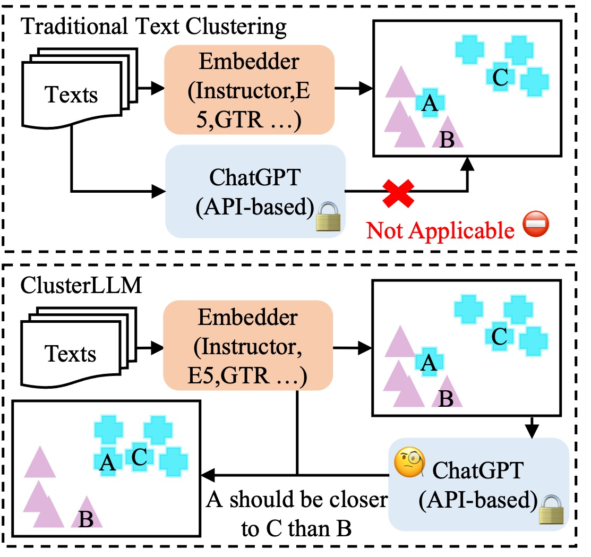

# CLUSTERLLM: Large Language Models as a Guide for Text Clustering



This is the official PyTorch implementation of paper [CLUSTERLLM: Large Language Models as a Guide for Text Clustering (EMNLP2023)](https://arxiv.org/abs/2305.14871).

## Install
```bash
pip install -r requirements.txt
```

## Datasets

Download zip file [here](https://drive.google.com/file/d/1TBq3vkfm3OZLi90GVH-PVNKi3fk1Vba7/view?usp=sharing) and unzip.

## Steps to run perspective experiments

### 1. Original embeddings
```bash
cd perspective/2_finetune
bash scripts/get_embedding.sh
```
The embeddings are produced in each folder of `datasets`. It will also save the clustering measures. Details instructions see bash script. E5 embeddings are produced with `scripts/get_embedding_e5.sh`.
### 2. Sample triplets
```bash
cd perspective/1_predict_triplet
bash scripts/triplet_sampling.sh
```
Sampled triplets will be produced in `perspective/1_predict_triplet/sampled_triplet_results`. Details instructions see bash script.
### 3. Predict triplets
First replace the openai keys in `perspective/1_predict_triplet/scripts/predict_triplet.sh`.
```bash
cd perspective/1_predict_triplet
bash scripts/predict_triplet.sh
```
Predicted triplets will be in `perspective/1_predict_triplet/predicted_triplet_results`. Details instructions see bash script.
### 4. Convert triplets
This step only converts the format.
```bash
cd perspective/2_finetune
bash scripts/convert_triplet.sh
bash scripts/convert_triplet_self.sh
```
Converted triplets will be in `perspective/2_finetune/converted_triplet_results`. Details instructions see bash script.
### 5. Finetune
```bash
cd perspective/2_finetune
bash scripts/finetune.sh
```
Finetuned model will be in `perspective/2_finetune/checkpoints`. Details instructions see bash script.
### 6. Finetune
```bash
cd perspective/2_finetune
bash scripts/get_embedding.sh
```
This time, switch to checkpoints. Clustering measures will be saved into checkpoint folder.

## Steps to run granularity experiments

### 1. Sample pairs
```bash
cd granularity
bash scripts/sample_pairs.sh
```
Sampled pairs will be saved in `sampled_pair_results`.
### [optional] Sample pairs for prompt
4 pairs will be sampled as in-context examples.
```bash
cd granularity
bash scripts/sample_pairs_for_prompt.sh
```
### 2. Predict pairs
First replace the openai keys in `granularity/scripts/predict_pairs.sh`.
```bash
cd granularity
bash scripts/predict_pairs.sh
```
Predicted pairs will be in `granularity/predicted_pair_results`. Also specify `prompt_file` to sampled the prompt.
### 3. Predict cluster num
```bash
cd granularity
bash scripts/predict_num_clusters.sh
```
Details instructions see bash script.

## Citation
```
@misc{zhang2023clusterllm,
      title={ClusterLLM: Large Language Models as a Guide for Text Clustering}, 
      author={Yuwei Zhang and Zihan Wang and Jingbo Shang},
      year={2023},
      eprint={2305.14871},
      archivePrefix={arXiv},
      primaryClass={cs.CL}
}
```

## Thanks
Some of the code was adapted from:
* https://github.com/xlang-ai/instructor-embedding

## Contact
Yuwei Zhang yuz163@ucsd.edu